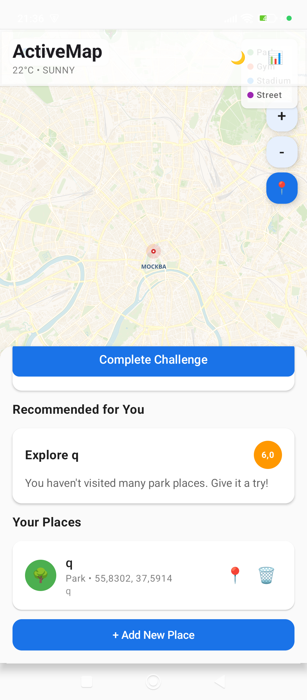
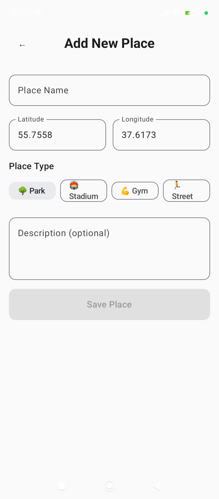
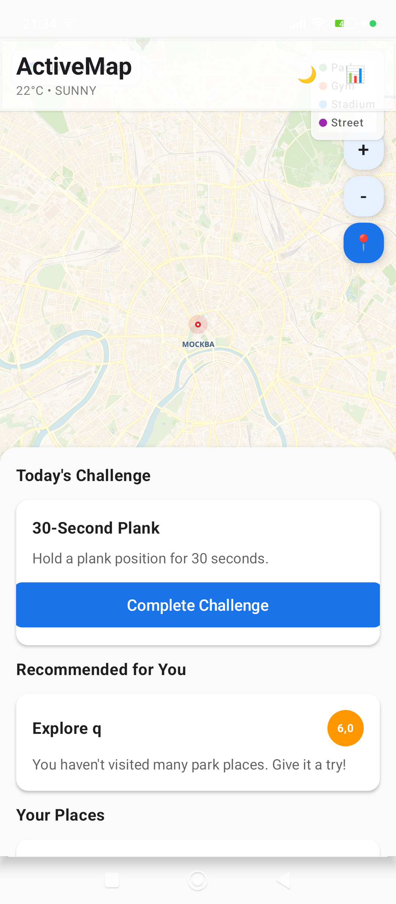

# ActiveMap: AI-Coach for Beginners

Kotlin Multiplatform app for beginners — add workout locations, get AI recommendations, complete daily challenges, and track your progress.






## Features

- **Custom Map Renderer** — no external map SDK, fully built on Jetpack Compose Canvas
- **OpenStreetMap tiles** — CartoDB Voyager basemap (free, no API key required)
- **Place markers with icons** — colored pins: 🌳 park, 🏟 stadium, 💪 gym, 🏃 street
- **Add places** — name, type, description; coordinates set automatically from crosshair
- **Navigate to place** — 📍 button centers the map on the selected place
- **Delete places** — with confirmation dialog
- **AI recommendations** — 12 built-in rules (time of day + weather + activity history)
- **Daily challenges** — walking, running, stretching, plank, squats, cardio
- **Export reports** — weekly Markdown report
- **Light/Dark theme** with smooth animations
- **Cross-platform** — Android and Desktop (JVM)

## Tech Stack

| Component | Technology |
|---|---|
| UI | Compose Multiplatform 1.7.1 |
| Map Renderer | Custom Compose Canvas (no external SDK) |
| Map Tiles | OpenStreetMap via CartoDB (voyager + light_all) |
| Storage | SQLDelight 2.0.2 |
| Serialization | kotlinx.serialization |
| Networking | java.net.HttpURLConnection |
| Testing | Kotest 5.9.1 |

### Custom Map Implementation

The project implements a **from-scratch OpenStreetMap renderer** instead of using commercial map SDKs:

```
Map Architecture:
├── OsmMapView.kt      # Core composable: Canvas rendering + Mercator projection
├── OsmTileLoader.kt   # HTTP tile fetching with fallback + in-memory cache
├── AndroidImageLoader.kt  # Platform-specific bitmap decoding (Android)
└── DesktopImageLoader.kt  # Platform-specific bitmap decoding (Desktop)
```

**Key features:**
- Mercator projection math (lon/lat ↔ tile coordinates)
- 7×7 tile grid centered on user position
- In-memory tile cache (no disk persistence)
- Custom pin graphics with emoji icons
- Platform-specific image loading via `expect`/`actual`

### Tile Providers

CartoDB Voyager chosen after testing alternatives:
- **Yandex Maps** — tile servers (`vec0*.maps.yandex.net`) not accessible outside Russia (DNS NXDOMAIN)
- **Mapbox** — public demo token expired, requires paid API key
- **CartoDB Voyager** — free, no key required, works globally, fast

## Build & Run

### Requirements
- JDK 17+ (21 recommended)
- Android SDK (`ANDROID_HOME`)
- Gradle 8.10+ (included via wrapper)

### Commands

```bash
# Desktop
./gradlew :composeApp:run

# Android APK
ANDROID_HOME=~/Library/Android/sdk ./gradlew :composeApp:assembleDebug

# Tests
./gradlew :composeApp:desktopTest

# Install on emulator/device
ANDROID_HOME=~/Library/Android/sdk ./gradlew :composeApp:installDebug
```

## Architecture

```
commonMain/
├── model/          # Place, Activity, Challenge, Recommendation, Report, Weather
├── engine/         # 12 recommendation rules (RuleEngine + sealed class Rule)
├── repository/     # SQLDelight DAO + reactive Flows
├── map/            # Custom OSM renderer: OsmTileLoader + OsmMap composable
├── export/         # MarkdownExporter
├── platform/       # expect/actual: LocationProvider, WeatherProvider, FileExporter
├── ui/
│   ├── screens/    # MapScreen, AddPlaceScreen, ReportScreen, ChallengeScreen
│   ├── components/ # RecommendationCard, ChallengeCard, PlaceListItem
│   ├── animation/  # fadeInSlideUp, pulseGlow, bounceAppear
│   └── theme/      # Material3 light/dark theme
└── viewmodel/      # MainViewModel + Screen sealed class

androidMain/        # AndroidLocationProvider, AndroidFileExporter, AndroidImageLoader
desktopMain/        # DesktopLocationProvider (mock), DesktopFileExporter, DesktopImageLoader
```

## Recommendation Engine

12 built-in rules (no external LLM):

| # | Rule | Condition |
|---|---|---|
| 1 | Streak Boost | streak >= 3 days |
| 2 | Morning Park Run | park, 6-9 AM, no rain |
| 3 | Afternoon Gym | gym, 12-5 PM |
| 4 | Evening Stadium | stadium, 5-8 PM |
| 5 | Rainy Day Gym | rain/snow |
| 6 | Hot Day Outdoor | temp > 30°C |
| 7 | Cold Day Street | temp < 5°C |
| 8 | Rest Day | >= 5 activities/week |
| 9 | Comeback | > 3 days inactive |
| 10 | Variety | few visits to certain type |
| 11 | Weekend Challenge | Sat/Sun 8-11 AM |
| 12 | Morning Stretch | 6-8 AM, park/gym |

## Animations

- **fade-in + slide-up** — recommendation and challenge cards (400-500ms, FastOutSlowIn)
- **pulse glow** — workout start button (scale 1.0→1.12, 1800ms cycle)
- **bounce appear** — map markers (keyframes, no libraries)
- **list stagger** — items appear one by one with delay
- **theme crossfade** — smooth color transition (300ms)
- **low-power mode** — disable all animations via `AnimationConfig`

## License

MIT License — see [LICENSE](LICENSE)

---

# ActiveMap: ИИ‑Тренер для Начинающих

Kotlin Multiplatform приложение для начинающих — добавляйте места для тренировок, получайте AI-рекомендации, выполняйте ежедневные челленджи и отслеживайте прогресс.

## Возможности

- **Кастомный рендерер карт** — без сторонних SDK, полностью на Jetpack Compose Canvas
- **Тайлы OpenStreetMap** — CartoDB Voyager (бесплатно, без API ключа)
- **Маркеры с иконками** — пины на карте с типами мест: 🌳 парк, 🏟 стадион, 💪 зал, 🏃 улица
- **Добавление мест** — имя, тип, описание; координаты определяются автоматически
- **Навигация к месту** — кнопка 📍 в списке мест перемещает карту к нему
- **Удаление мест** — с подтверждением
- **AI-рекомендации** — 12 встроенных правил (время суток + погода + история активности)
- **Ежедневные челленджи** — ходьба, бег, растяжка, планка, приседания, кардио
- **Экспорт отчётов** — Markdown-отчёт за неделю
- **Светлая/тёмная тема** с плавными анимациями
- **Cross-platform** — Android и Desktop (JVM)

## Стек

| Компонент | Технология |
|---|---|
| UI | Compose Multiplatform 1.7.1 |
| Рендерер карт | Кастомный Compose Canvas (без сторонних SDK) |
| Тайлы карт | OpenStreetMap через CartoDB (voyager + light_all) |
| Хранение | SQLDelight 2.0.2 |
| Сериализация | kotlinx.serialization |
| Сеть | java.net.HttpURLConnection |
| Тесты | Kotest 5.9.1 |

### Кастомная реализация карт

Проект реализует **собственный рендерер OpenStreetMap** вместо коммерческих SDK:

```
Архитектура карт:
├── OsmMapView.kt      # Основной компонент: Canvas + меркаторская проекция
├── OsmTileLoader.kt   # HTTP-загрузка тайлов с fallback + кэш в памяти
├── AndroidImageLoader.kt  # Платформенная декодировка (Android)
└── DesktopImageLoader.kt  # Платформенная декодировка (Desktop)
```

**Ключевые особенности:**
- Математика меркаторской проекции (lon/lat ↔ координаты тайлов)
- Сетка 7×7 тайлов, центрированная на позиции пользователя
- Кэш тайлов в памяти (без дисковой персистентности)
- Кастомная графика пинов с эмодзи
- Платформенная загрузка изображений через `expect`/`actual`

### Тайл-провайдеры

CartoDB Voyager выбран после тестирования альтернатив:
- **Яндекс Карты** — тайловые серверы (`vec0*.maps.yandex.net`) недоступны за пределами России (DNS NXDOMAIN)
- **Mapbox** — демо-токен истёк, требует платный API-ключ
- **CartoDB Voyager** — бесплатно, без ключа, работает глобально, быстрые тайлы

## Сборка и запуск

### Требования
- JDK 17+ (рекомендуется 21)
- Android SDK (`ANDROID_HOME`)
- Gradle 8.10+ (включён через wrapper)

### Команды

```bash
# Desktop
./gradlew :composeApp:run

# Android APK
ANDROID_HOME=~/Library/Android/sdk ./gradlew :composeApp:assembleDebug

# Тесты
./gradlew :composeApp:desktopTest

# Установка на эмулятор/устройство
ANDROID_HOME=~/Library/Android/sdk ./gradlew :composeApp:installDebug
```

## Архитектура

```
commonMain/
├── model/          # Place, Activity, Challenge, Recommendation, Report, Weather
├── engine/         # 12 правил рекомендаций (RuleEngine + sealed class Rule)
├── repository/     # SQLDelight DAO + реактивные Flow
├── map/            # Кастомный OSM рендерер: OsmTileLoader + OsmMap composable
├── export/         # MarkdownExporter
├── platform/       # expect/actual: LocationProvider, WeatherProvider, FileExporter
├── ui/
│   ├── screens/    # MapScreen, AddPlaceScreen, ReportScreen, ChallengeScreen
│   ├── components/ # RecommendationCard, ChallengeCard, PlaceListItem
│   ├── animation/  # fadeInSlideUp, pulseGlow, bounceAppear
│   └── theme/      # Material3 светлая/тёмная тема
└── viewmodel/      # MainViewModel + Screen sealed class

androidMain/        # AndroidLocationProvider, AndroidFileExporter, AndroidImageLoader
desktopMain/        # DesktopLocationProvider (мок), DesktopFileExporter, DesktopImageLoader
```

## Движок рекомендаций

12 встроенных правил (без внешних LLM):

| # | Правило | Условие |
|---|---|---|
| 1 | Streak Boost | streak >= 3 дней |
| 2 | Morning Park Run | парк, 6-9 утра, без дождя |
| 3 | Afternoon Gym | зал, 12-17 |
| 4 | Evening Stadium | стадион, 17-20 |
| 5 | Rainy Day Gym | дождь/снег |
| 6 | Hot Day Outdoor | температура > 30°C |
| 7 | Cold Day Street | температура < 5°C |
| 8 | Rest Day | >= 5 активностей за неделю |
| 9 | Comeback | > 3 дней без активности |
| 10 | Variety | мало посещений определённого типа |
| 11 | Weekend Challenge | суббота/воскресенье 8-11 |
| 12 | Morning Stretch | 6-8 утра, парк/зал |

## Анимации

- **fade-in + slide-up** — карточки рекомендаций и челленджей (400-500мс, FastOutSlowIn)
- **pulse glow** — кнопка старта тренировки (scale 1.0→1.12, цикл 1800мс)
- **bounce appear** — точки на карте (keyframes без библиотек)
- **list stagger** — появление элементов по одному с задержкой
- **theme crossfade** — плавное переключение темы (300мс)
- **low-power mode** — отключение анимаций через `AnimationConfig`

## Лицензия

MIT License — см. [LICENSE](LICENSE)
