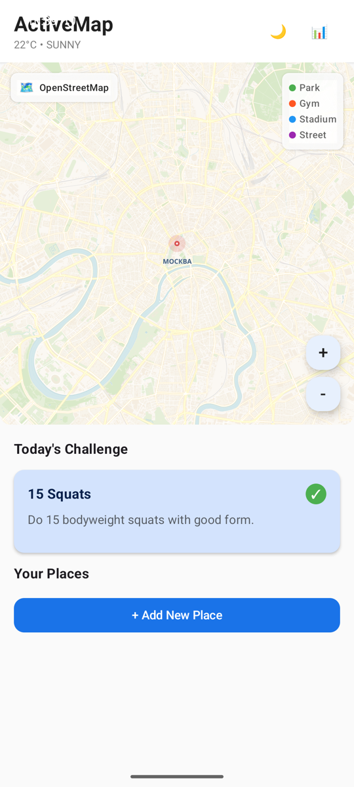
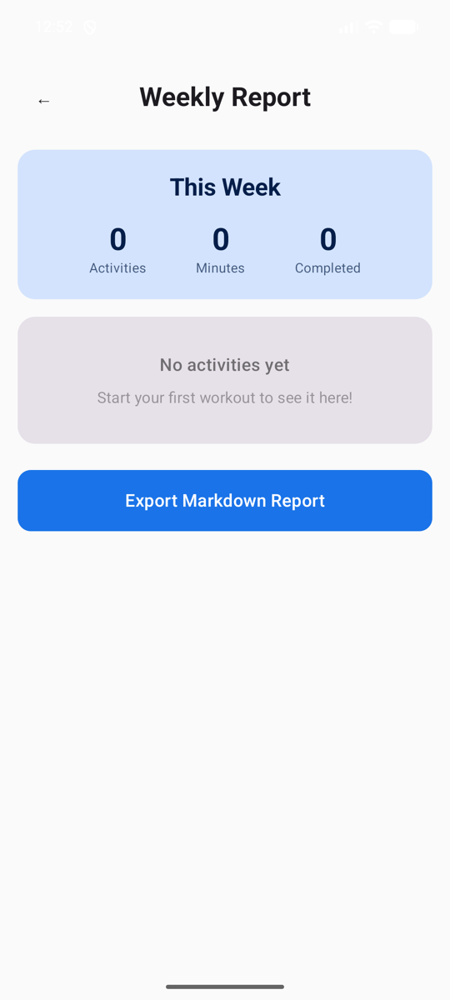
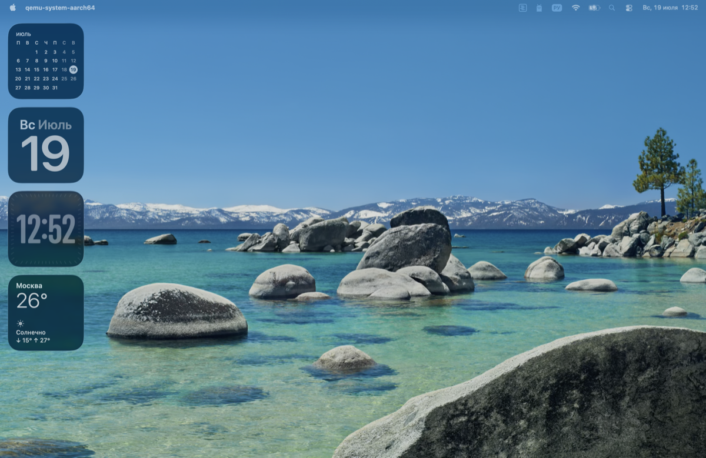

# ActiveMap: AI-Coach for Beginners

Kotlin Multiplatform приложение для начинающих — добавляйте места для тренировок, получайте AI-рекомендации, выполняйте ежедневные челленджи и отслеживайте прогресс.






## Возможности

- **Карта OpenStreetMap** — реальные тайлы с возможностью панорамирования и зума
- **Добавление мест** — парки, стадионы, залы, улицы с геокоординатами
- **AI-рекомендации** — 12 встроенных правил (время суток + погода + история активности)
- **Ежедневные челленджи** — ходьба, бег, растяжка, планка, приседания, кардио
- **Экспорт отчётов** — Markdown-отчёт за неделю
- **Светлая/тёмная тема** с плавными анимациями
- **Cross-platform** — Android и Desktop (JVM)

## Стек

| Компонент | Технология |
|---|---|
| UI | Compose Multiplatform 1.7.1 |
| Карта | OpenStreetMap (CartoDB тайлы) |
| Хранение | SQLDelight 2.0.2 |
| Сериализация | kotlinx.serialization |
| Сеть | java.net.HttpURLConnection |
| Тесты | Kotest 5.9.1 |

## Сборка и запуск

### Требования
- JDK 17+ (рекомендуется 21)
- Android SDK (`ANDROID_HOME`)
- Gradle 8.10+ (включён через wrapper)

### Команды

```bash
# Desktop
./gradlew :composeApp:run

# Android APK
ANDROID_HOME=~/Library/Android/sdk ./gradlew :composeApp:assembleDebug

# Тесты
./gradlew :composeApp:desktopTest

# Установка на эмулятор/устройство
ANDROID_HOME=~/Library/Android/sdk ./gradlew :composeApp:installDebug
```

## Архитектура

```
commonMain/
├── model/          # Place, Activity, Challenge, Recommendation, Report, Weather
├── engine/         # 12 правил рекомендаций (RuleEngine + sealed class Rule)
├── repository/     # SQLDelight DAO + Flow
├── map/            # OsmTileLoader + OsmMap composable
├── export/         # MarkdownExporter
├── platform/       # expect/actual: LocationProvider, WeatherProvider, FileExporter
├── ui/
│   ├── screens/    # MapScreen, AddPlaceScreen, ReportScreen, ChallengeScreen
│   ├── components/ # RecommendationCard, ChallengeCard, PlaceListItem
│   ├── animation/  # fadeInSlideUp, pulseGlow, bounceAppear
│   └── theme/      # Material3 светлая/тёмная тема
└── viewmodel/      # MainViewModel + Screen sealed class

androidMain/        # AndroidLocationProvider, AndroidFileExporter
desktopMain/        # DesktopLocationProvider (мок), DesktopFileExporter
```

## Движок рекомендаций

12 встроенных правил (без внешних LLM):

| # | Правило | Условие |
|---|---|---|
| 1 | Streak Boost | streak >= 3 дней |
| 2 | Morning Park Run | парк, 6-9 утра, без дождя |
| 3 | Afternoon Gym | зал, 12-17 |
| 4 | Evening Stadium | стадион, 17-20 |
| 5 | Rainy Day Gym | дождь/снег |
| 6 | Hot Day Outdoor | температура > 30°C |
| 7 | Cold Day Street | температура < 5°C |
| 8 | Rest Day | >= 5 активностей за неделю |
| 9 | Comeback | > 3 дней без активности |
| 10 | Variety | мало посещений определённого типа |
| 11 | Weekend Challenge | суббота/воскресенье 8-11 |
| 12 | Morning Stretch | 6-8 утра, парк/зал |

## Анимации

- **fade-in + slide-up** — карточки рекомендаций и челленджей (400-500мс, FastOutSlowIn)
- **pulse glow** — кнопка старта тренировки (scale 1.0→1.12, цикл 1800мс)
- **bounce appear** — точки на карте (keyframes без библиотек)
- **list stagger** — появление элементов по одному с задержкой
- **theme crossfade** — плавное переключение темы (300мс)
- **low-power mode** — отключение анимаций через `AnimationConfig`

## Лицензия

MIT License — см. [LICENSE](LICENSE)
